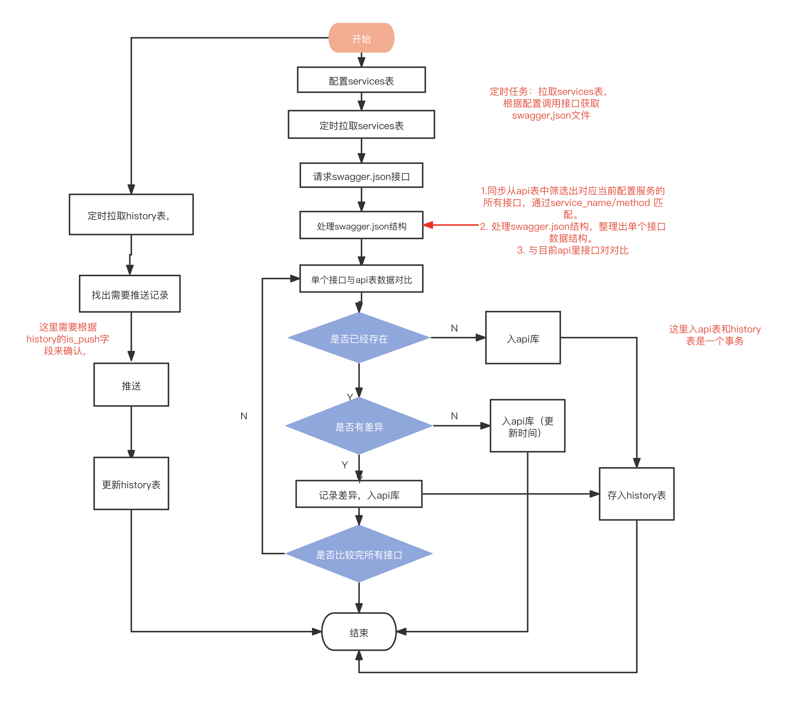

## 接口监控服务

一、背景及意义

针对当前前后端开发对接时，只是通过 swagger 对接接口文档，后端对接口的修改只能通过人工通知并告知修改字段内容。因此，这里处理的工作是基于 swagger 来监控接口的变化，并把差异接口和差异内容推送到相关人员的 teams。减少开发和测试过程中因接口字段修改而引起的问题。

二、技术架构-简易


三、项目流程


四、接口设计

| 接口路径                              | 描述                                                                                                                            |
| ------------------------------------- | ------------------------------------------------------------------------------------------------------------------------------- |
| POST /services-by-name                | 录入服务（比如 curl -X POSThttp://127.0.0.1:8080/services-by-name-d 'name=["service_name"]&channel={"service_name":["****"]}'） |
| GET /get-histories?page=1&pageSize=10 | 获取历史数据                                                                                                                    |
|                                       |

五、数据库设计

```
CREATE TABLE `service` (
`id` int(11) unsigned NOT NULL AUTO_INCREMENT,
`name` varchar(16) NOT NULL DEFAULT '' COMMENT '服务名称',
`url` varchar(64) NOT NULL DEFAULT '' COMMENT '服务地址',
`enable_push` int(4) NOT NULL DEFAULT '1' COMMENT '是否需要部署',
`channel` json NOT NULL COMMENT '推送频道',
`channel_type` varchar(32) NOT NULL DEFAULT '' COMMENT '频道类型，默认是 teams',
`created_at` datetime NOT NULL COMMENT '创建时间',
`updated_at` datetime NOT NULL COMMENT '更新时间',
PRIMARY KEY (`id`)
) ENGINE=InnoDB DEFAULT CHARSET=utf8mb4 COMMENT='后端接口服务对应的 eureka 接口以及需要推送的频道';
```

```
CREATE TABLE `api` (
`id` int(11) unsigned NOT NULL AUTO_INCREMENT,
`service_name` varchar(32) NOT NULL DEFAULT '' COMMENT '接口对应的服务名',
`path` varchar(64) NOT NULL DEFAULT '' COMMENT '接口路径',
`method` varchar(16) NOT NULL DEFAULT '' COMMENT '接口调用方法',
`params` json DEFAULT NULL COMMENT '入参',
`response` json DEFAULT NULL COMMENT '响应结果',
`summary` varchar(255) NOT NULL DEFAULT '' COMMENT '接口简介',
`entirety` json DEFAULT NULL COMMENT '整体数据',
`created_at` datetime NOT NULL COMMENT '创建时间',
`updated_at` datetime NOT NULL COMMENT '更新时间',
PRIMARY KEY (`id`),
KEY `idx_name_path_mothed` (`service_name`,`path`,`method`)
) ENGINE=InnoDB DEFAULT CHARSET=utf8mb4 COMMENT='存储每个接口数据。以 service_name，path，mothed 查询唯一接口。';
```

```
CREATE TABLE `history` (
`id` int(11) unsigned NOT NULL AUTO_INCREMENT,
`api_id` int(10) unsigned NOT NULL COMMENT '接口对应 id',
`is_push` int(11) DEFAULT NULL COMMENT '是否需要推送',
`service_name` varchar(32) NOT NULL DEFAULT '' COMMENT '对应接口服务名',
`path` varchar(64) NOT NULL DEFAULT '' COMMENT '对应接口路径',
`method` varchar(16) NOT NULL DEFAULT '' COMMENT '对应接口调用方法',
`params` json DEFAULT NULL COMMENT '入参',
`response` json DEFAULT NULL COMMENT '响应结果',
`summary` varchar(255) DEFAULT NULL COMMENT '概要',
`diff` text COMMENT '差异信息',
`created_at` datetime NOT NULL COMMENT '创建时间',
`updated_at` datetime NOT NULL COMMENT '更新时间',
PRIMARY KEY (`id`),
KEY `idx_api_id` (`api_id`)
) ENGINE=InnoDB DEFAULT CHARSET=utf8mb4;
```

六、预览

teams 接收信息

差异详情预览

七、项目使用相关

1. 生产环境如何启动服务？
   生产环境部署，分开部署检测开发环境 eureka 服务和测试环境 eureka 服务

```
<!-- 启动服务，检测开发环境eureka服务  -->

yarn start
//or

<!-- 启动服务，检测测试环境eureka服务  -->

yarn startTest
```

2. 录入服务
   调用 post /services-by-name 接口录入服务，必须传入服务的 name ,channel
   比如：

   ```
   curl -X POST http://127.0.0.1:8080/services-by-name -d 'name=["xxx"]&channel={"xxx":"""''}'）
   ```

五、本地开发注意事项
前端页面框架本地开发完后，使用

```
yarn build
yarn publish
```

把打包的 dist 包推送到后端服务的 dist 下
