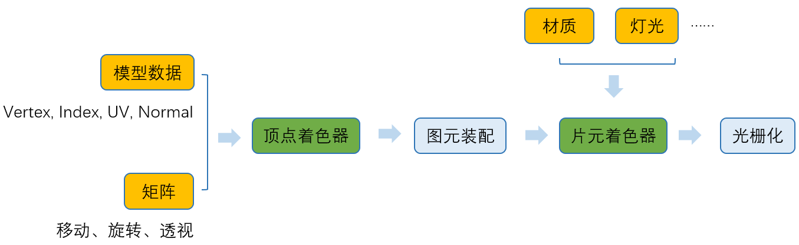
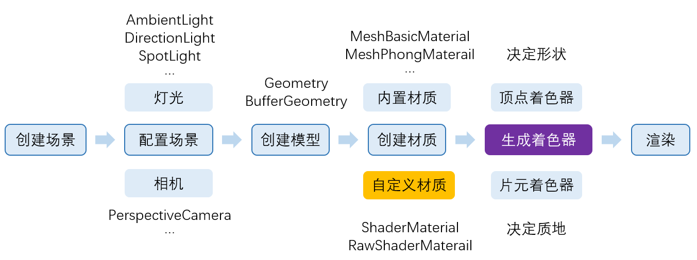

## 关于 Three js

1. 为什么学习 Three js?
   首先我们需要弄明白 Threejs 是什么？学他做甚？
   学习 Three js，其实我们是在学习怎么去做 Web 3D 展示；

   所以我们来看下 Threejs 是什么：
   简单来说它是一个 javascript 3d 库；

   > 一个易于使用、轻量级、跨浏览器的通用 3D 库。当前构建仅包含 WebGL 渲染器，但 WebGPU（实验性）、SVG 和 CSS3D 渲染器也可作为插件使用；

   那引出一个问题：WebGL 渲染器是什么？

2. **WebGL 渲染器是什么？**

   > WebGL 是一套用于渲染 2D 和 3D 图形的标准图形库；WebGL 提供了底层的渲染 API，对于传统 Web 开发者来说，使用 WebGL API 是比较复杂的，需要补充大量的 OpenGL ES 相关知识。

   来继续说一下 OpenGL 和 OpenGl ES?

   - OpenGL(Open Graphics Library)是一套规范，硬件厂商基于自家 GPU 硬件指令等来实现这个规范；开发者编写依据 OpenGL 规范，就可以在机器上看到对应的绘制结果；

   - [OpenGl ES：](https://zh.wikipedia.org/wiki/OpenGL_ES)
     OpenGL ES 是 OpenGL 的子集，针对手机、PDA 和游戏主机等嵌入式设备而设计。
     **OpenGL ES 是从 OpenGL 裁剪定制而来的，去除了 glBegin/glEnd，四边形（GL_QUADS）、多边形（GL_POLYGONS）等复杂图元等许多非绝对必要的特性。**

   - [WebGL](https://zh.wikipedia.org/wiki/WebGL)
     > WebGL 是一种 JavaScript API，用于在不使用插件的情况下在任何兼容的网页浏览器中呈现交互式 2D 和 3D 图形。WebGL 完全集成到浏览器的所有网页标准中，可将影像处理和效果的 GPU 加速使用方式当做网页 Canvas 的一部分。WebGL 元素可以加入其他 HTML 元素之中并与网页或网页背景的其他部分混合。WebGL 程序由 JavaScript 编写的句柄和 OpenGL Shading Language（GLSL）编写的着色器代码组成，该语言类似于 C 或 C++，并在电脑的图形处理器（GPU）上执行。WebGL 由非营利 Khronos Group 设计和维护。
     > WebGL 1.0 基于 OpenGL ES 2.0，并提供了 3D 图形的 API。它使用 HTML5 Canvas 并允许利用文档对象模型接口。WebGL 2.0 基于 OpenGL ES 3.0，确保了提供许多选择性的 WebGL 1.0 扩展，并引入新的 API。可利用部分 Javascript 实现自动存储器管理;

   简单理解：WebGL 是一个遵循 OpenGL ES 规范，为网页浏览器能呈现交互式 2D 和 3D 图形的 JavaScript API；

- Three.js 再次定义：
  **它是一个基于 WebGL Api 封装的，用于在浏览器中绘制 3D 图形的 JS 库；**

3. 涉及的一些图形基础的概念？

   - [笛卡尔坐标系](https://zh.wikipedia.org/zh/%E7%AC%9B%E5%8D%A1%E5%B0%94%E5%9D%90%E6%A0%87%E7%B3%BB)

   - 矩阵和矩阵变换：
     矩阵用于坐标变换，比如移动，旋转，缩放...

为什么要知道这些呢？--图形的展示，变换，都是基于在某一个坐标体系下，做顶点的变换；

4. **WebGL 的工作原理**
   > 主要参考：[图解 WebGL&Three.js 工作原理 ](https://www.cnblogs.com/wanbo/p/6754066.html)

- 4.1）**WebGL 绘图 API**：
  首先，我们看下 WebGL 绘图 API 提供的所有的 API:

  - 画点：gl.POINTS
  - 画线：gl.LINES
  - 画三角形：gl.TRIANGLES

  看到这 3 个 API，我们发现除了基础的点和线，面的话只有三角形，也就是说再怎么复杂的模型，都是由三角形构成；

- 4.2）**WebGL 绘制流程**
  简单说来，WebGL 绘制过程包括以下三步：
  1、获取**顶点坐标**
  2、**图元**装配（即画出一个个三角形）
  3、光栅化（生成**片元**，即一个个像素点）

顶点坐标---[装配]-->图元（图形）---[栅格化]-->片元--->像素

> 片元： 片元是在图元经过光栅化阶段后，被分割成一个个像素大小的基本单位。片元其实已经很接近像素了，但是它还不是像素。片元包含了比 RGBA 更多的信息，比如可能有深度值，法线，纹理坐标等等信息。片元需要在通过一些测试（如深度测试）后才会最终成为像素。可能会有多个片元竞争同一个像素，而这些测试会最终筛选出一个合适的片元，丢弃法线和纹理坐标等不需要的信息后，成为像素；

接下来我们说下这个处理过程的一些细节；

- 4.2.1 获取**顶点坐标**
  顶点坐标一般都是来源于三维软件导出，或者是框架生成；
  在获取到顶点坐标后，实现侧通常会将它存储在显存，即缓存区内，方便 GPU 更快读取。

- 4.2.2 **图元装配**
  图元配置，简单来说就是连接顶点画线，从而生成三角形的面；
  这个过程并不是完全自动的，开发者可以通过构建**顶点着色器**来控制图元的生成；

  这里疑问为什么需要**顶点着色器**？它的作用或目的是什么？

  > 着色器(Shader)是运行在 GPU 上的小程序。这些小程序为图形渲染管线的某个特定部分而运行。从基本意义上来说，着色器只是一种把输入转化为输出的程序。着色器也是一种非常独立的程序，因为它们之间不能相互通信；它们之间唯一的沟通只有通过输入和输出。

  > 顶点着色器（Vertex Shader）是你写进 GLSL 中的一个方法，**每个顶点调用一次，在这个方法中做一些数学运算后设置了一个特殊的 gl_Position 变量， 这个变量就是该顶点转换到裁剪空间中的坐标值，GPU 接收该值并将其保存起来**。

  所以简单来说顶点着色器的作用就是坐标计算；

- 4.2.3 **光栅化**
  光栅化过程及是由片元着色器对‘模型’进行细分和上色的过程；
  光栅化之后就形成了片元；（ps：什么是片元，上面有详细说明）

  所以最后总结下 WebGL 的整个工作流程：

  - 数据模型--》生成顶点着色器--》转换到裁剪空间中的坐标值--》图片装配--》生成图元--》生成片元着色器--》光栅化--》片元---》像素、

  > 个人简化理解：及从点的集合到面的切分，再到‘样式’，这是一个从模糊到清晰，也是一个从大体到局部细节的拆分和处理过程；

### Threejs 的作用

下图来源[图解 WebGL&Three.js 工作原理](https://www.cnblogs.com/wanbo/p/6754066.html)

Threejs 主要参与顶点着色器和片元着色器的生成；
任务也主要处理模型变换，模型材质，色泽；

下面看下 Threejs 完整的运行流程：
下图来源[图解 WebGL&Three.js 工作原理](https://www.cnblogs.com/wanbo/p/6754066.html)

所以我们总结一句：
Threejs 主要作用是在相机，灯光等环境因素的作用下，针对模型的自身形状，大小和材质，以及进行的变换（移动，旋转，缩放等）而进行渲染（调用 WebGL API）；

1. https://www.npmjs.com/package/three
2. 图解 WebGL&Three.js 工作原理 :https://www.cnblogs.com/wanbo/p/6754066.html
