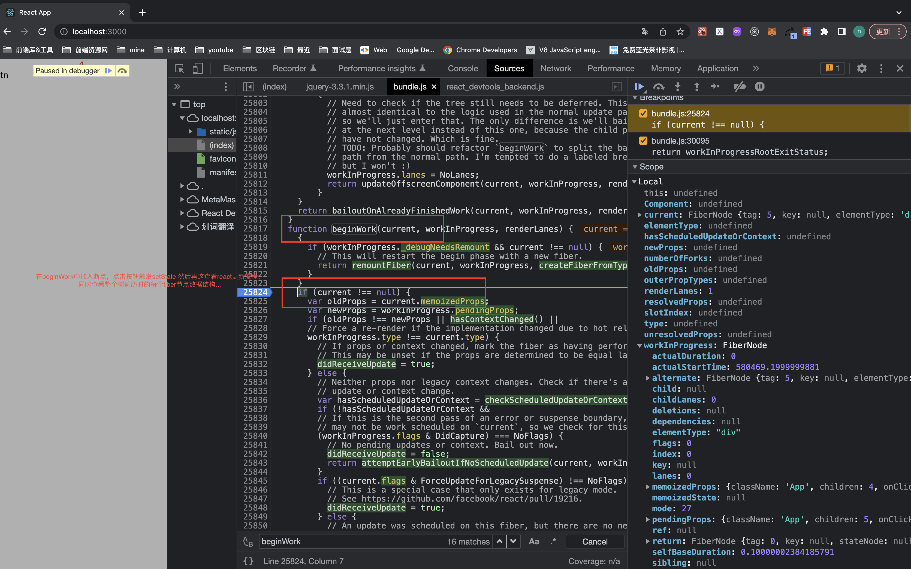

## React 源码学习笔记--归纳

1. 关于怎么去学习？
   1）首先：了解新东西的定义，是什么，处理什么问题的；--what  
   2）了解和熟悉基本的，正确的使用；--how  
   3）了解其为什么要这么做，了解其思想；--why  
   4) 通过思想，再去自顶向下的理解学习一些关键点，去思考与之前理解的差异，进一步去验证自己是否正的理解这些思想；

2. React 是什么？

   > React 是用于构建用户界面的 Javascript 库；

   > React 的理念哲学是快速响应；

   - 用户界面的 Javascript 库
   - 快速响应

   这里我们再理解下，什么是快速响应？
   我们讨论 React 应用在浏览器上运行这个前提下；
   快速响应，及浏览器快速响应用户事件操作；
   再细化，响应用户事件操作分为：
   1）用户事件触发执行；--js 执行，动画执行...  
   2）新的 UI 渲染到页面上；--GUI 渲染...

   我们知道主流浏览器刷新频率为 60Hz，即每（1000ms / 60Hz）16.6ms 浏览器刷新一次；刷行这一次，也就是这一帧的事件阶段：

   > 一个 task(宏任务) -- 队列中全部 job(微任务) --(还有时间的话，可能是下一个宏任务)-- requestAnimationFrame -- 浏览器重排/重绘 -- requestIdleCallback

   其次，GUI 渲染线程和 js 线程是互斥的；

   同时，涉及新资源的数据也都是需要通过网络获取；

   所以我们的快速响应，需要经过这些过程和条件的约束；

   so，React 理念是快速响应，那制约快速响应的因素是哪些？
   从上我们可以知道：

   - CPU 瓶颈：js 执行速度

   - IO 瓶颈：网络延迟：它是前端开发者无法解决的；

3. React 是怎么做的呢？
   思想是：对 React 任务进行调度，区分任务优先级，让 CPU 优先执行更重要的任务；同时任务的执行可中断，这样支持更高优先级任务及时执行，也避免被长任务长时间占用；
   思想总结：异步，可中断，可调度的任务执行；

   再以上思想的指导下，React 设计的架构：

   - Schadule 架构

     - schaduler(调度)
       重要概念：
       - 时间切片----时间切片的本质是模拟实现 requestIdleCallback
         - 中断设置：及剩余时间到期则中断
         - 中断重启：通过设置宏任务，当浏览器执行下一次宏任务时，再被唤起；优先利用 MesaageChannel 创建宏任务，当然也可以用 setTimeout;
       - 优先级调度：
         - lane 模型

   - Fiber 架构
     - reconciler(协调)---对应 render 阶段
     - renderer(渲染)---对应 commit 阶段

   所以，React 的设计思想也是分层架构，单一原则；
   从以上 React 的架构中，我们关于核心 Fiber 架构，这也是 React 异步可中断的核心；

   > 程序由数据结构和算法组成；

   我们先来看一个 Fiber 架构的数据结构；  
   我们知道 Fiber 之前，React 的协调叫栈协调，一旦开始，不能中断；
   Fiber 架构我们知道利用了双缓存技术，及有 current '树'和 workInProgress '树'，对应关联起来应用中的 Fiber 节点，虽然叫'树'，但实际在存储结构上是链表，React 已经把其从树行结构转换为链表结构存储；这种链表结构，为 React 的可中断提供底层支持；

   React 中，处处可见链表；除了 fiber 节点的连接是链表，状态记录，如记录组件 hooks 的属性 memoizedState，也是一个链表；对于组件每个 hooks 来说，存储该 hooks 的每次更新的状态的结构-queue 也是一个链表，比较独特的是，它是一个单向有环链表，这样的结构与任务优先级调度有关；
   此外，协调阶段产生手机的副作用，也是以链表结构存储；

   看了数据结构，我们再来看看算法：

   1. reconciler(协调)---对应 render 阶段
      分两种情况考虑：

      - mount 加载阶段
      - update 更新阶段

      具体程序执行大概分两个阶段：
      [ps：这个可以查看如下的 React 流程调试图中]

      - beginWork-- 执行阶段（包括 diff 算法的过程）
        首先从 rootFiber 开始向下深度优先遍历，实际物理结构时遍链表，为遍历到的每个 Fiber 节点调用 beginWork 方法；
      - completeWork-- 收集阶段
        --从 performUnitOfWork 函数中可以看出，当前节点不存在子节点时，beginWork 的工作完成后，开始进入 completeWork；
        当当前节点的 completeWork 完成后，如果其存在兄弟 Fiber 节点，就进入其兄弟节点的 beginWork 阶段；  
        (源码文件 packages/react-reconciler/src/ReactFiberWorkLoop.new.js)

      抛开细节，这里简单归纳下：
      不停的按树的深度优先搜索遍历，执行协调,各组件**处理和收集--及‘递’和‘归’**阶段会交错执行直到“归”到 rootFiber。render 阶段及协调的工作就结束了。

   2. renderer(渲染)---对应 commit 阶段
      主要是执行渲染，更新真实节点 dom，执行渲染后事件，以及之前收集的副作用等；

      before mutation：读取组件变更前的状态，针对类组件，调用 getSnapshotBeforeUpdate，让我们可以在 DOM 变更前获取组件实例的信息；针对函数组件，异步调度 useEffect。

      mutation：针对 HostComponent，进行相应的 DOM 操作；针对类组件，调用 componentWillUnmount；针对函数组件，执行 useLayoutEffect 的销毁函数。

      layout：在 DOM 操作完成后，读取组件的状态，针对类组件，调用生命周期 componentDidMount 和 componentDidUpdate，调用 setState 的回调；针对函数组件填充 useEffect 的 effect 执行数组，并调度 useEffect

---

### 补充 1:

**diff 算法**  
1）先找出能直接复用的节点（及没有修改，也不用移动的节点），以该点为当前标记点（lastPlacedIndex）  
2）之后遍历剩余新节点与 oldFiber 链比较；

比较原则如下

```
 const current = newFiber.alternate; //oldFiber链
 if (current !== null) {
   const oldIndex = current.index;
   if (oldIndex < lastPlacedIndex) { //与标记点对比。这里为什么会这样来对比呢？

     // This is a move.
     newFiber.flags |= Placement | PlacementDEV;
     return lastPlacedIndex;
   } else {
     // This item can stay in place.
     return oldIndex;
   }
 } else {
   // This is an insertion.
   newFiber.flags |= Placement | PlacementDEV;
   return lastPlacedIndex;
 }
```

> 源码关注：placeChild 函数：
> 如下
> lastPlacedIndex = placeChild(newFiber, lastPlacedIndex, newIdx);

上面有提问到，为什么会这样来对比呢？
其实我们这里要把握这个算法的思想：及**右移原则**；构造所有点都只能右移的情况下，怎么移动移动那些可复用节点；

3）新子节点未在旧 fiber 链上找到的标记新增。旧 fiber 链未被匹配的标记删除；

---

### 补充 2：

React 一些流程调试图：  
reconcile:


commit


debug 查看一个 update 的流程以及整棵树的 fiber 结构结构和当前状态的数据。


[测试代码库地址](https://github.com/huwuji/blog/tree/master/Demo/react-debug-test)

---

> 源码概述：https://zh-hans.reactjs.org/docs/codebase-overview.html

> [《React 技术揭秘》](https://react.iamkasong.com/)

> [React 哲学](https://zh-hans.reactjs.org/docs/thinking-in-react.html)

> 「英文」尤雨溪论 JavaScript 框架设计哲学：平衡: https://www.bilibili.com/video/BV134411c7Sk/?from=search&seid=17404881291635824595
