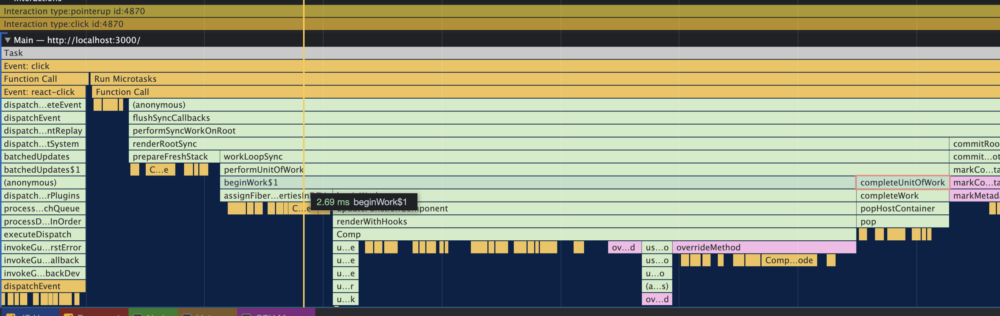
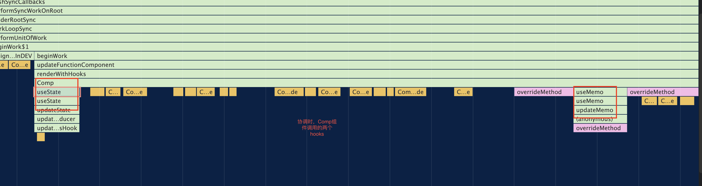
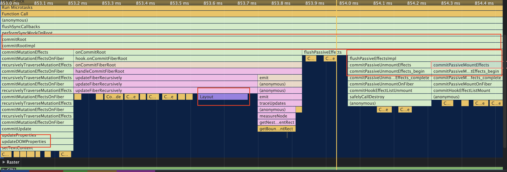

## 关于 useEffect

先上场景：
demo-1:

```
useEffect(()=>{
    //根据state处理
    console.log('a',state)
    return ()=>{
        // 通过redux的dispatch，清除一些额外的model数据（与state无关）
        console.log('b')
    }
},[state]);
```

问：每次 state 变更，'b'会打印吗？
但凡有实践精神的，实践一下就知道。
然后，可能还有一些写了一年以上的 React Hooks 的开发还停留在网文上所看到的片面内容，如 useEffect 的 return 的函数执行时机可以类比于类组件的 componentWillUnmount 生命周期阶段；
这个理解是有条件的，也是一个对于从 Class 方式到 Hooks 方式的一个过渡理解；
如上的代码，我们应该如下代码来编辑，这个时候，我们可以理解，这里的'b'是在组件卸载的时候；
demo-2:

```
useEffect(()=>{
    //根据state处理
    console.log('a',state)
},[state]);

useEffect(()=>{
    return ()=>{
        // 通过redux的dispatch，清除一些额外的model数据（与state无关）
        console.log('b')
    }
},[]);
```

### 实践出真知

如上我们实践可以知道,demo-1 中，第一次渲染时-及 mount 时，'b'不会打印；而当后续 state 每次改变时，'b'都会打印。

疑问：为什么会执行呢？
要解释这个问题，我们可以重新构造一些 demo-1，
如
demo-3

```
useEffect(()=>{
    //根据state处理
    console.log('a',state)
    return ()=>{
        // 通过redux的dispatch，清除一些额外的model数据（与state无关）
        console.log('b',state)
    }
},[state]);
```

我们会发现，打印'b'时对应的值是上一次 state 的值；

结论：
当 useEffect 有依赖时，每次依赖改变，useEffect 的第一个参数(create 函数)执行前会先执行上一次 create 函数执行后的返回函数(destroy);

### 从原理到源码

基于 React v18

1.  Hooks 有两个阶段：

    - mount
    - update
      useEffect 对应
    - mountEffect
    - updateEffect

    ?React Hooks 怎么区分两个阶段？
    --react-reconciler：ReactFiberHooks.new.js 文件

    ```
    ReactCurrentDispatcher.current =
      current === null || current.memoizedState === null
        ? HooksDispatcherOnMount
        : HooksDispatcherOnUpdate;
    ```

    从这个片段代码我们可以理解到；

    我们再从 useEffect 的函数的定义处下手追踪：
    源码对应 React 库的 ReactHooks.js 文件。

    ```
    export function useEffect(

        create: () => (() => void) | void,
        deps: Array<mixed> | void | null,
        ): void {
        const dispatcher = resolveDispatcher();
        return dispatcher.useEffect(create, deps);
    }
    ```

    然后 react-reconciler 的 ReactFiberHooks.new.js 文件：
    我们看到 useEffect 分两个阶段：

    - mountEffect
    - updateEffect

    我们先看 mountEffect：
    这里列出这一阶段过程的关键流程：
    -->mountEffect

    ```
    return mountEffectImpl(
      PassiveEffect | PassiveStaticEffect,
      HookPassive,
      create,
      deps,
    );
    ```

    这里要注意 tag 赋值的是 PassiveEffect,
    对应源码 ReactFiberFlags.js

    ```
    export const Passive = /*                      */ 0b00000000000000010000000000;
    ```

    接着走
    -->mountEffectImpl
    --->pushEffect( 处理属性，挂钩到 currentlyRenderingFiber 上,而 currentlyRenderingFiber = workInProgress;)
    (ps:workInProgress 是 fiber 架构流程的‘工作树’，所以要理解 fiber 流程)

    在看 updateEffect 流程：
    updateEffect
    -->updateEffectImpl
    看如下代码片段

    ```
      if (areHookInputsEqual(nextDeps, prevDeps)) {
        hook.memoizedState = pushEffect(hookFlags, create, destroy, nextDeps);
        return;
      }
      ...

       currentlyRenderingFiber.flags |= fiberFlags;
        hook.memoizedState = pushEffect(
        HookHasEffect | hookFlags,
        create,
        destroy,
        nextDeps,
    );
    ```

    理解：当 updateEffect 执行时，会判断依赖是否改变（areHookInputsEqual），改变和不改变的区别是同步到 hook.memoizedState 的状态 tag 值不一样。

> 关于 fiber 架构的流程：

    1）一个主流程--及workLoop，简单理解它是通过监听浏览器的requestIdleCallback而不断执行的函数。其中通过performUnitOfWork不断的执行workInProgress；

    2）三棵树：currentTree,workInProgressTree,effectListTree

    3) workInProgressTree:主要围绕构建这棵树(通过alternat对应到currentTree对应fiber节点),包括构建虚拟dom对应的真实Dom，reconciler，标记增删改节点，并记录其effect到effectListTree，同时设置下一个执行单元及nextUnitOfWork;（通过调度不断的执行，也就是render阶段）；当nextUnitOfWork不存在时，及深度遍历结束后。一次性提交及commit阶段，执行effectList更新dom到浏览器上（包括增删改节点），用workInProgressTree替代currentTree；
    （这里一直说tree，指的是逻辑结构，物理阶段其实被转换成链表，及child子节点，同父节点的多个子节点转为相邻节点，通过属性sibling指向）；

    ---todo更多补充--

### useEffect 执行后，同步的状态数据怎么在 React 的工作流中发挥作用？

    有fiber架构，我们知道要关注到fiber的工作流程;
    及从ReactFiberWorkLoop.new.js 文件，我们梳理出流程中涉及到useEffect执行的,如下是
    --> performConcurrentWorkOnRoot
    -->finishConcurrentRender
    -->commitRoot
    --->commitRootImpl
    -->flushPassiveEffects
    -->flushPassiveEffectsImpl
    ```
    // flushPassiveEffectsImpl的方法中我们可以看到如下方法调用
    commitPassiveUnmountEffects(root.current);
    commitPassiveMountEffects(root, root.current, lanes, transitions);
    ```
    先调用了commitPassiveUnmountEffects，我们先沿着commitPassiveUnmountEffects来追踪：
    如下：
    -->commitPassiveUnmountEffects
    -->commitPassiveUnmountOnFiber
        ```
        // 对应之前useEffect执行时赋值给workInProgress当前fiber节点的
        const destroy = effect.destroy;
        effect.destroy = undefined;
        if (destroy !== undefined) {
            ...
            if (finishedWork.flags & Passive) {
            commitHookPassiveUnmountEffects(
            finishedWork,
            finishedWork.return,
            HookPassive | HookHasEffect,
            );
        }
        }
        ```
    -->commitHookPassiveUnmountEffects
    -->commitHookEffectListUnmount(这里就是答案)
    ```
    const destroy = effect.destroy;
       ...
         safelyCallDestroy(finishedWork, nearestMountedAncestor, destroy);
    ```
    -->safelyCallDestroy
    ```
    destroy();
    ```
    及在这里执行;

    关于effect.destroy怎么来的，我们看commitPassiveMountEffects的流程：
    commitPassiveMountEffects
    -->commitPassiveMountOnFiber
    -->commitHookPassiveMountEffects
    -->commitHookEffectListMount
    ```
     // Mount
        const create = effect.create;
        if (__DEV__) {
          if ((flags & HookInsertion) !== NoHookEffect) {
            setIsRunningInsertionEffect(true);
          }
        }
        effect.destroy = create();
    ```

一些流程调试图：  
reconcile:



commit


[测试代码库地址](https://github.com/huwuji/blog/tree/master/Demo/react-debug-test)

### 总结：

    我们可以怎么理解：
    React fiber工作流程为主流程，而Hooks的执行是分枝流程，通过同步标签状态，存储参数，执行函数参数及记录其执行结果回调等信息到主流程的工作单元上，主流程按部就班的执行约定流程，并通过状态的做判断。
    在这里理解就是fiber工作流程每次commit时，会先判断标签是否执行hooks的上一次传入函数执行后的回调函数，然后再执行当前的传入函数。

    这里就回到上述3个demo；
    及每次useEffect执行会先判断上一次依赖是否改变，改变就先执行上一次函数返回值console.log('b')，否则不执行；再执行这次的console.log('a');
