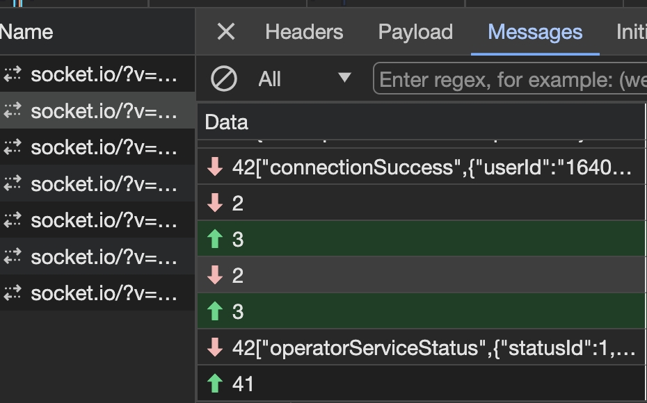

## The Socket.IO protocol

#### 场景

我们在处理socket的消息时，会发现如图一样的信息  

   

那怎么理解如下的数字含义呢？比如42？  
如下我们继续来看。

#### Socket.IO 的分层结构

Socket.IO 代码库分为两个不同的层

- 低层管道：我们称之为 Engine.IO，即 Socket.IO 内部的发动机
- 高级 API：Socket.IO 本身

#### Socket.IO 协议

Socket.IO 协议建立在前面描述的 Engine.IO 协议之上，这意味着每个 Socket.IO 数据包在通过网络发送时都将以“4”（Engine.IO MESSAGE 数据包类型）为前缀。
socketIo的信息如果没有二进制元素，格式如下:

```<packet type>[JSON-stringified payload]```  

*可用数据包类型的列表如下：*

| 类型             | ID | 用途                                        |
| --------------- | -- | -------------------------------------------- |
| CONNECT         | 0  | 用于连接到命名空间时使用。                   |
| DISCONNECT      | 1  | 用于从命名空间断开连接时使用。               |
| EVENT           | 2  | 用于向另一端发送数据。                       |
| ACK             | 3  | 用于确认事件（这里未使用）。                 |
| CONNECT_ERROR   | 4  | 用于连接到命名空间时发生错误（这里未使用）。  |
| BINARY_EVENT    | 5  | 用于向另一端发送二进制数据（这里未使用）。   |
| BINARY_ACK      | 6  | 用于确认事件（响应包含二进制数据）（这里未使用）。

如图所对应：42["connectionSuccess",{}];  
这里这个connectionSuccess是约定定义的topic类型；

所以：

42:则是通过*Engine.IO MESSAGE 数据包类型*,向另一端发送消息；

如图最后的信息41:则是通过*Engine.IO MESSAGE 数据包类型*,向另一端发送一个断开请求；

> 参考来源：

1. [the socketio protocol base](https://socket.io/zh-CN/how-to/build-a-basic-client#the-socketio-protocol)  

2. [The socketIo protocol more](https://socket.io/zh-CN/docs/v4/socket-io-protocol
)

3. [The Engine.IO protocol basic](<https://socket.io/zh-CN/how-to/build-a-basic-client#the-engineio-protocol>)

4. [The Engine.IO protocol more](https://socket.io/zh-CN/docs/v4/engine-io-protocol)

5. [运作原理](https://socket.io/zh-CN/docs/v4/how-it-works/)
