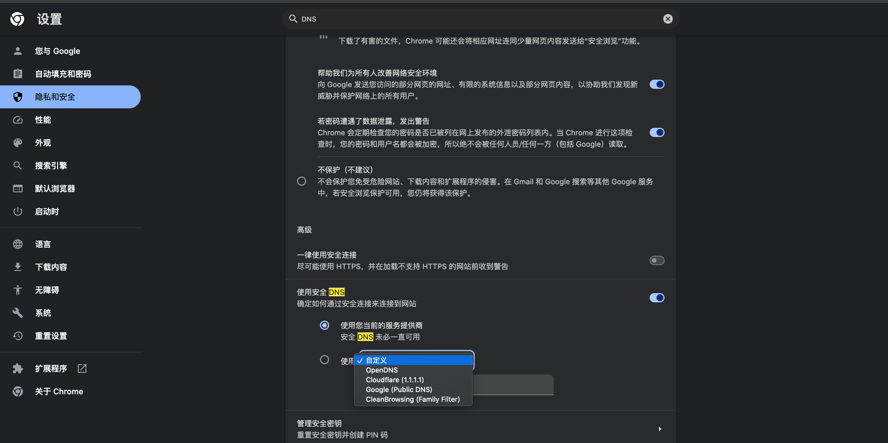

### 国内常用的DNS服务器

1. 114  DNS
DNS地址：114.114.114.114

2. Google DNS
DNS地址：8.8.8.8

3. CloudFlare NDS
DNS地址：1.1.1.1

> Cloudflare 网络的强大功能使 1.1.1.1 在提供快速 DNS 查询方面具有天然优势。由于它已集成到跨越全球 310 个城市的 Cloudflare 网络中，因此全球任何地方的用户都可以从 1.1.1.1 获得快速响应。

> 参考：<https://www.cloudflare.com/zh-cn/learning/dns/what-is-1.1.1.1/>

此外，网络中的数据中心可以访问 Cloudflare 平台上的数百万个互联网资产，从而以闪电般的速度对这些域进行查询。总体而言，独立 DNS 监控器 DNSPerf 将 1.1.1.1 列为世界上最快的 DNS 服务：

### chrome dns 配置

### 实际问题

1. 场景：某客户浏览器发起socket连接时，一直提示连接超时。
但是在CMD中ping是正常的。也只是那一个客户的电脑异常；
（ps:之前有遇到，重启后客户问题解决了。）分析可能是chrome的DNS解析的问题，尝试切换下chrome的 DNS的服务商，发现问题解决

### 拓展

1. 可以使用[chrome://net-internals/?#dns]来查看chrome的缓存的某个域名的ip地址；（及之前通过DNS服务器解析的地址）
